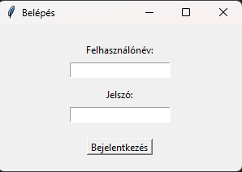
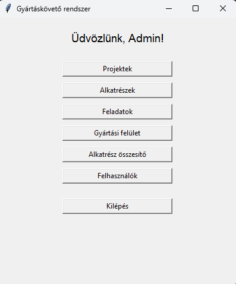
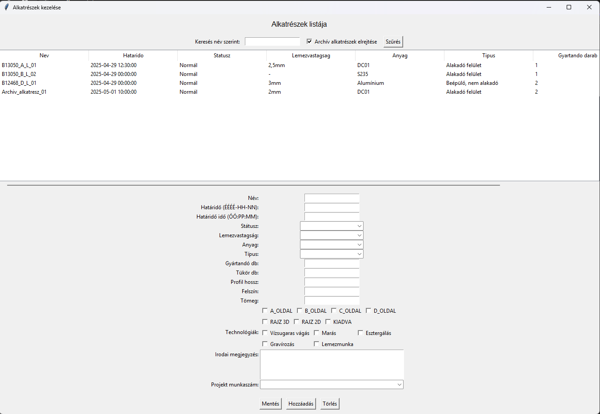
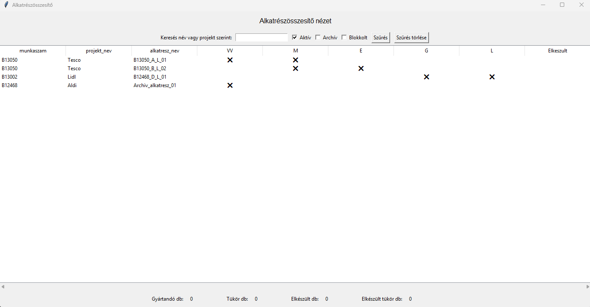

# Gyártáskövető rendszer

Ez a Python alapú asztali alkalmazás lehetővé teszi a gyártási projektekhez kapcsolódó alkatrészek és feladatok nyomon követését. A rendszer többféle jogosultsági szintet kezel, és lehetőséget biztosít a gyártás különböző szempontok szerinti megjelenítésére, kezelésére.

## Főbb funkciók

- Felhasználónév/jelszavas belépés (jogosultságokkal)
- Projektek létrehozása, módosítása
- Alkatrészek adminisztrálása: határidő, anyag, technológia, státusz
- Gyártási státusz követése technológiai fázisok szerint (vágás, marás stb.)
- Összesítő nézet projekt/alkatrész szinten
- Felhasználói felület: Tkinter

## Jogosultságok

Különböző szerepkörök elérhető funkciókat szabályoznak:
- Operátor
- Technológus
- Projektvezető
- Adminisztrátor

## Használat

1. **Adatbázis létrehozása**:
    ```bash
    python database/create_db.py
    ```

2. **Program indítása**:
    ```bash
    python main.py
    ```

## Képernyőképek

### Belépés


### Főmenü


### Alkatrészek kezelése


### Összesítő nézet



## Könyvtárstruktúra

Részletes fájlstruktúra megtalálható a `filestruct.txt` fájlban.

## Függőségek

Lásd: `requirements.txt`

## Megjegyzés

Ez a projekt egy alap Python kurzus keretein belül készült, ugyanakkor valós ipari igény alapján lett kialakítva, egy fémipari gyártócég működését modellezve. Bár még fejlesztés alatt áll, a funkciók már most is lehetővé teszik az alkatrészkövetés alapvető adminisztrációját.

---

